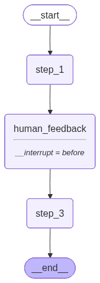
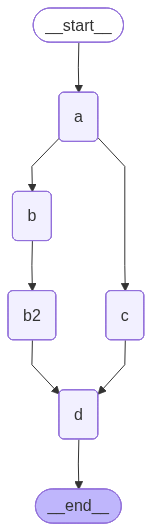
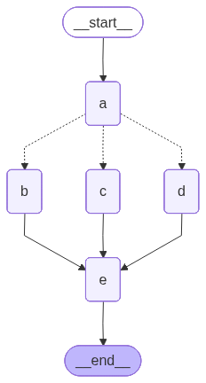

# Human0in-the-Loop/MemoryPersistance/Async

Small LangGraph learning project with three focused examples:

- persisted human-in-the-loop execution with SQLite checkpoints
- parallel branch execution with an explicit join
- conditional routing across different branch combinations

## What this project demonstrates

- A typed persisted workflow state in `state.py`
- A linear human-in-the-loop graph in `graph.py`
- A driver script in `main.py` that pauses, updates state, and resumes execution
- Reducer-based shared state aggregation with `Annotated[..., operator.add]`
- Parallel branch execution in `asyncgraph1.py`
- Conditional branch selection in `asyncgraph2.py`
- Mermaid image output under `images/`

## Project files

- `state.py` - typed state for the persisted workflow
- `nodes.py` - simple node functions used by the persisted workflow
- `graph.py` - builds the persisted workflow and configures checkpointing
- `main.py` - runs the persisted workflow end to end
- `asyncgraph1.py` - fan-out plus join example
- `asyncgraph2.py` - conditional routing example
- `pyproject.toml` - Python project metadata and dependencies
- `uv.lock` - locked dependency versions for `uv`
- `LTM_PersistanceDB.sqlite` - generated local checkpoint database
- `images/graph.png` - persisted workflow diagram
- `images/asyncgraph1.png` - parallel workflow diagram
- `images/asyncgraph2.png` - conditional workflow diagram

## Setup

This project targets Python 3.13 and uses `uv` for dependency management.

```powershell
uv sync
```

If you are not using `uv`, create a virtual environment and install the project
dependencies from `pyproject.toml`.

## Run the persisted workflow

```powershell
uv run python main.py
```

The script will:

1. Load environment variables from `.env` if one exists.
2. Build the LangGraph workflow.
3. Save checkpoints to `LTM_PersistanceDB.sqlite`.
4. Render the graph to `images/graph.png`.
5. Start a thread with `thread_id` set to `1`.
6. Run until the `human_feedback` interrupt.
7. Ask for feedback in the terminal.
8. Update the saved state with that feedback.
9. Resume the graph and complete execution.



## Run the parallel branch example

```powershell
uv run python asyncgraph1.py
```

Execution shape:

```text
START -> a -> (b -> b2) and c -> d -> END
```



`aggregate` is a reducer-backed list. Each node returns a partial update such as
`{"aggregate": ["I'm B"]}`, and LangGraph merges those returned values into the
shared state.

## Run the conditional routing example

```powershell
uv run python asyncgraph2.py
```

Execution shape with the current in-file input:

```text
START -> a -> b and c -> e -> END
```



The `which` input field decides the branch pair after node `a`:

- `which == "cd"` routes to `c` and `d`
- any other value routes to `b` and `c`

Like `asyncgraph1.py`, `aggregate` stores node outputs through reducer-based
state merging. The branch nodes do not pass values directly into `e`; they write
into shared graph state, and `e` receives that accumulated state when it runs.

## Notes

- `LTM_PersistanceDB.sqlite`, `LTM_PersistanceDB.sqlite-wal`, and
  `LTM_PersistanceDB.sqlite-shm` are runtime SQLite files.
- Running the script again with the same `thread_id` reuses the same checkpoint
  namespace.
- Change the `thread_id` value in `main.py` when you want a fresh independent
  run without clearing the SQLite database.
- `asyncgraph1.py` and `asyncgraph2.py` each render their own diagram under
  `images/` when executed.
