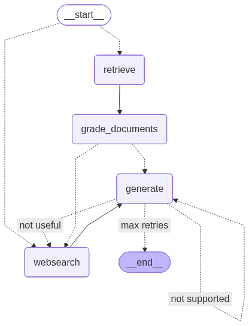
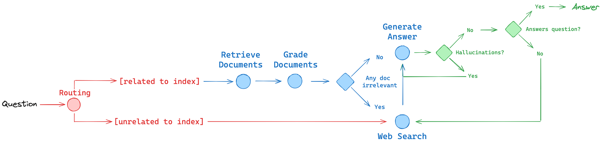
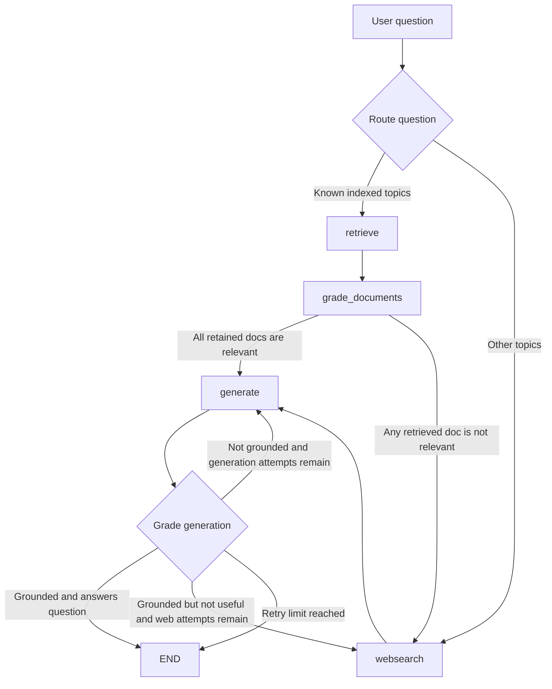
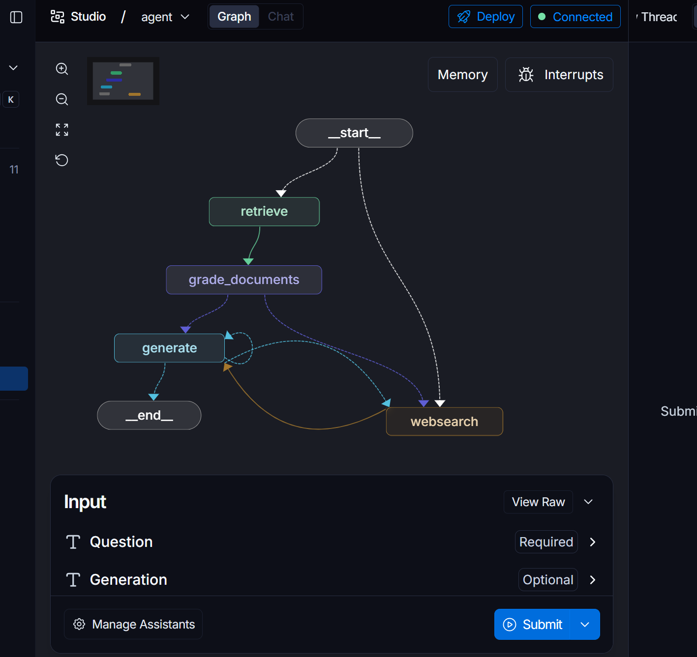

# Agentic RAG With LangGraph

This project is a learning implementation of an agentic Retrieval-Augmented
Generation system built with LangGraph, LangChain, OpenAI, Weaviate, Tavily,
and LangSmith Hub prompts.

The application answers a user question by choosing the best data source,
retrieving or searching for context, grading context quality, generating an
answer, checking whether the answer is grounded, and retrying through explicit
graph control flow when the answer is weak.

The current branch is focused on the Advanced RAG pattern sometimes called
Adaptive RAG, Corrective RAG, or Self-RAG. It is not a free-form autonomous
agent. The "agentic" behavior comes from LLM-powered routing, grading,
rewriting, and retry decisions inside a deterministic LangGraph workflow.



## What This Project Does

Given a question, the graph can:

1. Route the question to a Weaviate vector store when the topic matches the
   indexed knowledge base.
2. Route the question to Tavily web search when the topic is outside the
   indexed knowledge base.
3. Retrieve the top relevant vector documents from Weaviate.
4. Grade each retrieved document for relevance to the question.
5. Add web search results when retrieval is missing or partially irrelevant.
6. Generate an answer from the accumulated documents.
7. Grade the answer for hallucination against the retrieved facts.
8. Grade whether the grounded answer actually addresses the user question.
9. Retry generation or web search with bounded limits.

The default indexed knowledge base is built from four web articles:

- Agents: `https://lilianweng.github.io/posts/2023-06-23-agent/`
- Prompt engineering: `https://lilianweng.github.io/posts/2023-03-15-prompt-engineering/`
- Adversarial attacks on LLMs: `https://lilianweng.github.io/posts/2023-10-25-adv-attack-llm/`
- Long-term memory with LangGraph Store: `https://prynai.github.io/2025/10/16/Long-Term-Memory-LangGraph-Store.html`

The router is intentionally aligned to the indexed topics. Its prompt currently
names agents, prompt engineering, and adversarial attacks; the PrynAI article
extends the agent-memory portion of the corpus. Questions about agents, prompt
engineering, adversarial attacks, or agent memory should use the vector store.
Questions outside those topics should use web search.

## Why This Architecture Exists

Basic RAG usually follows one fixed path:

```text
question -> retrieve documents -> generate answer
```

That works only when retrieval is reliable and the indexed corpus actually
contains enough information. This project adds agentic control points around
that simple flow:

- The router prevents irrelevant vector retrieval when the question belongs
  outside the indexed domain.
- The retrieval grader filters weak context before generation.
- The web search node repairs missing context when local retrieval is not
  enough.
- The hallucination grader checks whether the answer is supported by the
  supplied facts.
- The answer grader checks whether the supported answer still answers the
  original question.
- Retry counters prevent infinite loops.

The purpose is to make the answer path adaptive while keeping the execution
easy to inspect, test, and extend. LangGraph is used because this design is a
state machine with conditional edges, not a single linear chain.

The companion architecture sketch shows the same control flow at a higher
level:



## Architecture At A Glance



The graph is defined in `graph/graph.py` and compiled into `app`.

```python
from graph.graph import app

result = app.invoke({"question": "agent memory?"})
```

The graph returns a state dictionary that can include the original question,
retrieved documents, generated answer, retry counters, and the last web search
query.

## Repository Layout

```text
.
|-- main.py                              # Minimal entry point that invokes the graph
|-- langgraph.json                       # LangGraph CLI config for local Studio testing
|-- rag/
|   |-- ingestion.py                     # Loads web pages, chunks them, embeds them, writes to Weaviate
|   `-- retriever.py                     # Exposes a Weaviate retriever with k=3
|-- pyproject.toml                       # Python project metadata and dependencies
|-- uv.lock                              # Locked dependency resolution for reproducible installs
|-- images/
|   |-- AdvancedAgenticRAG.png           # Generated compiled LangGraph image
|   |-- Architecture.png                 # High-level architecture sketch
|   `-- langgraphstudioinlangsmith.png   # LangSmith Studio view of the local graph
`-- graph/
    |-- graph.py                         # LangGraph topology, routing, conditional edges, retry decisions
    |-- state.py                         # TypedDict state schema passed between nodes
    |-- consts.py                        # Node names and retry limits
    |-- nodes/
    |   |-- retrieve.py                  # Vector-store retrieval node
    |   |-- grade_documents.py           # Document relevance filtering node
    |   |-- generate.py                  # RAG answer generation node
    |   `-- web_search.py                # Tavily web search and query rewriting node
    `-- chains/
        |-- router.py                    # Structured router: vectorstore vs websearch
        |-- retrieval_grader.py          # Structured document relevance grader
        |-- generation.py                # RAG generation chain using LangSmith Hub prompt
        |-- hallucination_grader.py      # Structured groundedness grader
        |-- answer_grader.py             # Structured answer usefulness grader
        |-- search_query_rewriter.py     # Rewrites failed questions for web search
        `-- tests/test_chains.py         # Integration-style tests for chains
```

## Runtime Services

This project depends on external services at runtime.

| Service | Used For | Code Location |
| --- | --- | --- |
| OpenAI | Chat model calls and embeddings | `graph/chains/*.py`, `rag/ingestion.py` |
| Weaviate Cloud | Vector database for indexed documents | `rag/ingestion.py`, `rag/retriever.py` |
| Tavily | Web search fallback | `graph/nodes/web_search.py` |
| LangSmith Hub | Pulls the public `rlm/rag-prompt` prompt | `graph/chains/generation.py` |
| LangGraph | Stateful graph orchestration | `graph/graph.py` |
| LangGraph CLI | Local Agent Server used by LangSmith Studio | `langgraph.json` |

The code currently uses `ChatOpenAI(model="gpt-5-nano", temperature=0)` for
router, grader, rewriter, and generation chains. `OpenAIEmbeddings()` is used
for document embeddings.

## Environment Variables

Create a `.env` file in the project root. `.env` is already ignored by
`.gitignore`.

```bash
OPENAI_API_KEY=your_openai_api_key
TAVILY_API_KEY=your_tavily_api_key
WEAVIATE_URL=your_weaviate_cloud_url
WEAVIATE_API_KEY=your_weaviate_api_key
WEAVIATE_COLLECTION_NAME=Langgraphwebcollection

# Optional, depending on your LangSmith setup.
LANGSMITH_API_KEY=your_langsmith_api_key
LANGSMITH_TRACING=true
```

`WEAVIATE_COLLECTION_NAME` is optional. If it is not set, the code uses
`Langgraphwebcollection`.

`LANGSMITH_API_KEY` is required when connecting the local Agent Server to
LangSmith Studio. Keep `LANGSMITH_TRACING=true` when you want traces recorded
in LangSmith, or set it to `false` when you want to use the local server without
sending trace data to LangSmith.

## Installation

This project is configured with `uv` and requires Python `>=3.13`.

```bash
uv sync
```

The project already includes `langgraph-cli[inmem]` in `pyproject.toml`, so
`uv sync` installs the local CLI needed for LangSmith Studio testing. If you are
adding Studio support to an older checkout, the equivalent dependency command is:

```bash
uv add "langgraph-cli[inmem]"
```

If you are not using `uv`, install the dependencies from `pyproject.toml` with
your preferred Python environment manager.

## Running The Project

Run the default example question:

```bash
uv run python main.py
```

`main.py` loads environment variables, imports the compiled graph, and invokes:

```python
app.invoke(input={"question": "agent memory?"})
```

To ask a different question without editing the graph:

```bash
uv run python -c "from graph.graph import app; print(app.invoke({'question': 'how to make pizza?'}))"
```

Expected high-level behavior:

- `agent memory?` should route to the vector store because it is related to
  agents.
- `how to make pizza?` should route to web search because it is outside the
  indexed corpus.

## Testing The Graph In LangSmith Studio

This repository is configured for local LangSmith Studio testing through the
LangGraph CLI. The setup is defined in `langgraph.json`:

```json
{
  "graphs": {
    "agent": "./graph/graph.py:app"
  },
  "env": ".env",
  "dependencies": ["."]
}
```

This points Studio at the compiled `app` graph exported from
`graph/graph.py`, loads environment variables from `.env`, and installs the
current repository as the graph dependency.

### Start The Local Agent Server

From the project root, run:

```bash
uv run langgraph dev
```

If your virtual environment is already active, `langgraph dev` is equivalent.
The CLI starts a local Agent Server on:

```text
http://127.0.0.1:2024
```

### Open Studio

With the dev server running, open LangSmith Studio at:

```text
https://smith.langchain.com/studio/?baseUrl=http://127.0.0.1:2024
```

Studio should load the `agent` graph from `langgraph.json` and render the
workflow visually:



### What Developers Can Test There

Use Studio to:

1. Submit questions such as `agent memory?` or `how to make pizza?`.
2. Watch the graph route between retrieval and web search.
3. Inspect which nodes executed, the evolving graph state, and intermediate
   values.
4. Re-run the graph after prompt, routing, or node changes during local
   development.

### Studio-Specific Notes For This Repository

- `LANGSMITH_API_KEY` should be present in `.env` before starting the dev
  server.
- Starting `langgraph dev` imports the graph, so this project can still trigger
  the same import-time ingestion behavior described later in this README.
- Because the graph uses OpenAI, Tavily, Weaviate, and a LangSmith Hub prompt,
  the same service credentials used for normal runs are also needed for a full
  Studio test session.

## Important Runtime Behavior

The current learning implementation performs ingestion at import time.

The dependency chain is:

```text
main.py
  -> graph.graph
    -> graph.nodes.retrieve
      -> rag/retriever.py
        -> rag/ingestion.py
```

Because `rag/retriever.py` imports `vectorstore` from `rag/ingestion.py`, importing the
graph can load the source URLs, split documents, create embeddings, connect to
Weaviate, and write documents to the configured collection.

`graph/graph.py` also writes the compiled LangGraph visualization to
`images/AdvancedAgenticRAG.png` when the graph is imported.

That is acceptable for a small learning project, but in a production system
indexing should be separated from query serving. A production version should
usually move ingestion behind an explicit command such as:

```bash
uv run python -m rag.ingestion
```

and make `rag/retriever.py` connect to an existing collection without re-ingesting
documents.

## Data Ingestion Logic

`rag/ingestion.py` performs the indexing workflow:

1. Load `.env`.
2. Read `WEAVIATE_COLLECTION_NAME`, defaulting to `Langgraphwebcollection`.
3. Define the source URLs.
4. Load each URL with `WebBaseLoader`.
5. Flatten the loaded documents into one list.
6. Split documents with `RecursiveCharacterTextSplitter.from_tiktoken_encoder`.
7. Use `chunk_size=250` and `chunk_overlap=20`.
8. Create OpenAI embeddings with `OpenAIEmbeddings()`.
9. Connect to Weaviate Cloud with `WEAVIATE_URL` and `WEAVIATE_API_KEY`.
10. Store document chunks in Weaviate through `WeaviateVectorStore.from_documents`.

The vector text field is configured as `text`.

## Retriever Logic

`rag/retriever.py` exposes one retriever:

```python
from rag.ingestion import vectorstore

retriever = vectorstore.as_retriever(search_kwargs={"k": 3})
```

Every retrieval call returns the top three matching documents from the
configured Weaviate collection.

## Graph State

The shared state is defined as `AgenticRagState` in `graph/state.py`.

| Field | Required | Meaning |
| --- | --- | --- |
| `question` | Yes | Original user question. |
| `generation` | No | Current generated answer. |
| `web_search` | No | Boolean flag set by document grading when web search is needed. |
| `documents` | No | Current list of `Document` objects from retrieval and web search. |
| `generation_attempts` | No | Number of times the graph has tried to generate an answer. |
| `web_search_attempts` | No | Number of times the graph has called web search. |
| `web_search_query` | No | Last query sent to Tavily. |

Nodes return partial state updates. LangGraph merges those updates into the
current graph state.

## Nodes

### `retrieve`

File: `graph/nodes/retrieve.py`

Inputs:

- `question`

Behavior:

- Calls the Weaviate retriever with the user question.
- Stores the returned documents in state.

Returns:

- `documents`
- `question`

### `grade_documents`

File: `graph/nodes/grade_documents.py`

Inputs:

- `question`
- `documents`

Behavior:

- Sends each retrieved document to the retrieval grader.
- Keeps documents graded as relevant.
- Drops documents graded as not relevant.
- Sets `web_search=True` if any retrieved document is not relevant.

Returns:

- Filtered `documents`
- `question`
- `web_search`

Design note: this is a conservative correction step. Even if some documents are
useful, one irrelevant document is enough to trigger web search so the graph can
repair missing context before generation.

### `web_search`

File: `graph/nodes/web_search.py`

Inputs:

- `question`
- Optional existing `documents`
- Optional `generation`
- Optional `web_search_attempts`

Behavior:

- Uses the original question as the first web search query.
- On later web search attempts, rewrites the query using the original question
  and the previously generated answer.
- Calls Tavily with `max_results=3`.
- Joins Tavily result content into a single `Document`.
- Appends the web result document to the current document list.
- Increments `web_search_attempts`.

Returns:

- Updated `documents`
- `question`
- `web_search_attempts`
- `web_search_query`

### `generate`

File: `graph/nodes/generate.py`

Inputs:

- `question`
- Optional `documents`
- Optional `generation_attempts`

Behavior:

- Calls the generation chain with `{context: documents, question: question}`.
- Increments `generation_attempts`.

Returns:

- `documents`
- `question`
- `generation`
- `generation_attempts`

## Chains

### Router Chain

File: `graph/chains/router.py`

The router is a structured-output chain. It returns:

```python
class RouteQuery(BaseModel):
    datasource: Literal["vectorstore", "websearch"]
```

Prompt behavior:

- Use `vectorstore` for questions about agents, prompt engineering, and
  adversarial attacks.
- Use `websearch` for everything else.

This chain decides the conditional entry point in `graph/graph.py`.

### Retrieval Grader Chain

File: `graph/chains/retrieval_grader.py`

The retrieval grader is a structured-output chain. It returns:

```python
class GradeDocuments(BaseModel):
    binary_score: str
```

Expected values are `"yes"` or `"no"`.

Prompt behavior:

- Grade a document as relevant if it contains keyword or semantic meaning
  related to the user question.
- Return only a binary relevance score.

This chain is used by `grade_documents`.

### Generation Chain

File: `graph/chains/generation.py`

The generation chain:

1. Creates a LangSmith `Client`.
2. Pulls the public prompt `rlm/rag-prompt`.
3. Pipes the prompt into `ChatOpenAI`.
4. Parses the model response into a string.

```python
generation_chain = prompt | llm | StrOutputParser()
```

The expected input keys are:

- `context`
- `question`

### Hallucination Grader Chain

File: `graph/chains/hallucination_grader.py`

The hallucination grader is a structured-output chain. It returns:

```python
class GradeHallucinations(BaseModel):
    binary_score: bool
```

`True` means the generated answer is grounded in the supplied documents.
`False` means the answer is not sufficiently supported by the facts.

This chain decides whether the graph can trust the answer or should retry
generation.

### Answer Grader Chain

File: `graph/chains/answer_grader.py`

The answer grader is a structured-output chain. It returns:

```python
class GradeAnswer(BaseModel):
    binary_score: bool
```

`True` means the answer directly addresses the original user question.
`False` means the answer may be grounded but is still not useful for the
question asked.

This distinction matters because an answer can be factual but still fail the
user intent.

### Search Query Rewriter Chain

File: `graph/chains/search_query_rewriter.py`

The query rewriter is used only after a previous answer was graded as not
useful and the graph needs another web search attempt.

Inputs:

- `question`
- `generation`

Output:

- A concise web search query string.

The prompt tells the model to use the original question and previous answer to
identify missing information, then return only the search query.

## Conditional Flow Details

### Entry Routing

`route_question` in `graph/graph.py` calls the router chain.

```text
RouteQuery.datasource == "vectorstore" -> retrieve
RouteQuery.datasource == "websearch"   -> websearch
```

### Retrieval Repair Decision

After `retrieve`, the graph always moves to `grade_documents`.

`decide_to_generate` checks the `web_search` flag:

```text
web_search == True  -> websearch
web_search == False -> generate
```

### Generation Quality Decision

After `generate`, `grade_generation_grounded_in_documents_and_question` performs
two checks:

1. Hallucination check: is the answer grounded in the documents?
2. Answer check: does the grounded answer address the question?

Outcomes:

| Result | Meaning | Next Step |
| --- | --- | --- |
| `useful` | Answer is grounded and answers the question. | `END` |
| `not supported` | Answer is not grounded but generation attempts remain. | `generate` |
| `not useful` | Answer is grounded but does not answer the question and web attempts remain. | `websearch` |
| `max retries` | Retry limit reached. | `END` |

Retry limits live in `graph/consts.py`:

```python
MAX_GENERATION_ATTEMPTS = 3
MAX_WEB_SEARCH_ATTEMPTS = 2
```

## End-To-End Example: Vector Store Question

Question:

```text
agent memory?
```

Expected flow:

```text
route_question -> retrieve -> grade_documents -> generate -> grade answer -> END
```

Possible correction flow:

```text
route_question -> retrieve -> grade_documents -> websearch -> generate -> grade answer -> END
```

This happens when the router correctly chooses the vector store but the
retrieved chunks are incomplete or partially irrelevant.

## End-To-End Example: Web Search Question

Question:

```text
how to make pizza?
```

Expected flow:

```text
route_question -> websearch -> generate -> grade answer -> END
```

If the first generated answer is grounded but does not answer the question,
the graph can rewrite the search query and call Tavily again until
`MAX_WEB_SEARCH_ATTEMPTS` is reached.

## Tests

The tests are in `graph/chains/tests/test_chains.py`.

Run them with:

```bash
uv run pytest graph/chains/tests
```

These are integration-style tests. They call live services:

- OpenAI chat models
- OpenAI embeddings
- Weaviate
- LangSmith prompt hub

Because of that, the tests require valid environment variables and network
access. They are useful for validating that the chains and service wiring work,
but they are not isolated unit tests.

## Developer Build Guide

### Add Or Change Indexed Documents

Update the `SOURCE_URLS` list in `rag/ingestion.py`.

Then run the application or ingestion script with valid Weaviate credentials.
In the current implementation, importing the graph can trigger ingestion.

Recommended production improvement:

- Make ingestion an explicit CLI or script.
- Add document IDs or hashes to avoid duplicate writes.
- Close the Weaviate client after indexing.
- Keep query-time retriever construction separate from indexing.

### Change Routing Behavior

Edit the router prompt in `graph/chains/router.py`.

If the vector store contains new topics, update this sentence:

```text
The vectorstore contains documents related to agents, prompt engineering, and adversarial attacks.
```

The router should describe the actual corpus. If it is too broad, unrelated
questions may be routed to retrieval. If it is too narrow, relevant questions
may go to web search unnecessarily.

The current corpus also includes the PrynAI long-term memory article. If you
want LangGraph Store or long-term memory questions to route explicitly to the
vector store, add those topics to the router prompt instead of relying only on
the broader agents wording.

### Tune Retrieval

Edit `rag/retriever.py`:

```python
retriever = vectorstore.as_retriever(search_kwargs={"k": 3})
```

Increase `k` when answers need more context. Decrease `k` when retrieval is
noisy or expensive.

### Tune Retry Behavior

Edit `graph/consts.py`:

```python
MAX_GENERATION_ATTEMPTS = 3
MAX_WEB_SEARCH_ATTEMPTS = 2
```

Higher values can improve recovery but increase latency and cost. Lower values
make failure faster and cheaper.

### Change Models

The model is defined separately in each chain module:

- `graph/chains/router.py`
- `graph/chains/retrieval_grader.py`
- `graph/chains/generation.py`
- `graph/chains/hallucination_grader.py`
- `graph/chains/answer_grader.py`
- `graph/chains/search_query_rewriter.py`

All currently use:

```python
ChatOpenAI(model="gpt-5-nano", temperature=0)
```

Use lower-cost models for simple routing and grading when acceptable. Use a
stronger model for generation if answer quality is more important than cost.

### Add A New Node

To add another capability:

1. Create a node function in `graph/nodes/`.
2. Export it from `graph/nodes/__init__.py`.
3. Add a node name constant in `graph/consts.py`.
4. Register the node with `workflow.add_node(...)` in `graph/graph.py`.
5. Add normal or conditional edges to connect it to the graph.
6. Add any required state fields to `AgenticRagState` in `graph/state.py`.

Good candidate nodes:

- Citation formatting
- Source deduplication
- Human approval
- Answer summarization
- Query expansion
- Cost or latency guardrails

## Production Hardening Checklist

Before using this design beyond a learning project, consider these changes:

- Separate ingestion from app import and request handling.
- Avoid duplicate vector writes by using deterministic document IDs.
- Add collection creation and migration logic for Weaviate.
- Close the Weaviate client after ingestion.
- Add retries and timeouts around OpenAI, Tavily, Weaviate, and LangSmith.
- Add structured logging instead of `print` statements.
- Add source citations to final answers.
- Add unit tests with mocked LLM and retriever responses.
- Add integration tests behind an explicit marker, such as `pytest -m integration`.
- Centralize model names and service configuration.
- Validate required environment variables at startup.
- Add error handling for empty retrieval and empty web search results.
- Consider caching prompt pulls from LangSmith.
- Track token usage and latency for each chain.

## Current Limitations

- Importing the graph can perform indexing because ingestion is not isolated.
- The vector store domain is narrow and hard-coded in the router prompt.
- The generation prompt is pulled from LangSmith Hub at runtime.
- Tests require external services and are not deterministic unit tests.
- Web search results are joined into one document, so individual source metadata
  is not preserved in the final state.
- Final answers do not currently include citations.
- The Weaviate client close call is commented out in `rag/ingestion.py`.

## Why This Is Useful

This project is useful for developers learning how to move from simple RAG to
agentic RAG:

- It shows how to express LLM application control flow as a graph.
- It keeps each decision point isolated in a small chain or node.
- It demonstrates structured outputs for routing and grading.
- It shows how retrieval, web search, generation, and verification can work
  together.
- It provides clear extension points for production features.

The main design lesson is that better RAG is not only about better generation.
It is also about deciding when to retrieve, when to search, what context to
trust, whether the answer is grounded, and when to stop retrying.

LangSmith tracing link: https://smith.langchain.com/public/dcf68017-71f6-4d0e-a687-f1091e32c4ab/r
