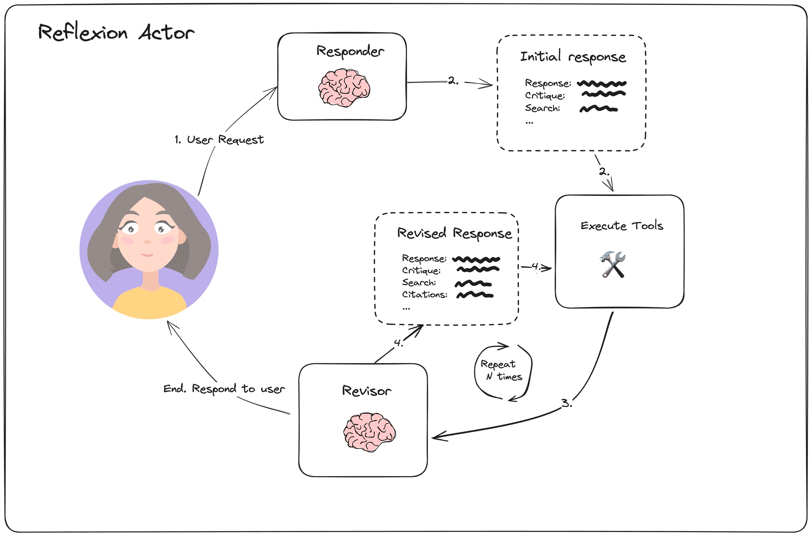
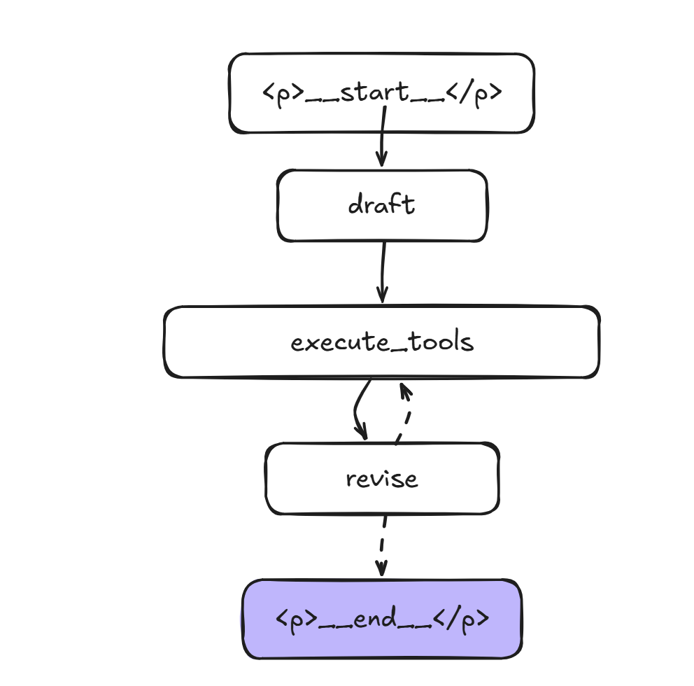
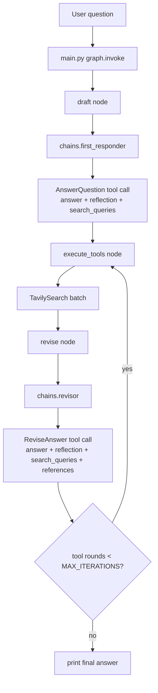
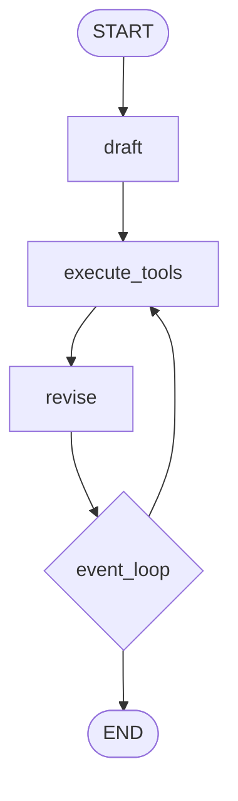
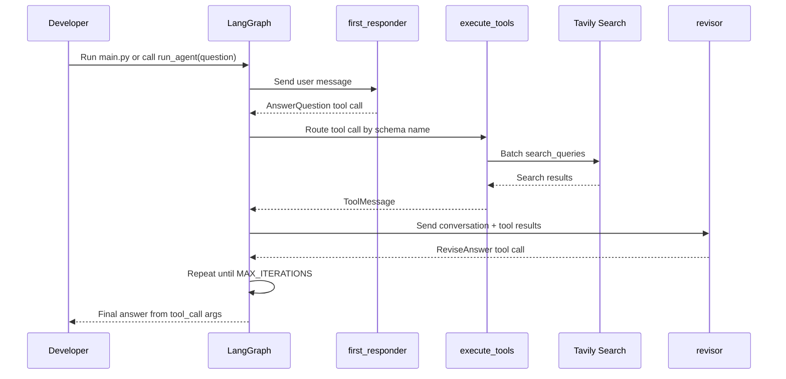

# AgenticAI - Applied Reflexion Architecture with LangGraph

This project is a minimal LangGraph research agent. It drafts an answer, critiques
its own response, generates search queries, runs Tavily search, and revises the
answer with citations.

The repository includes two rendered PNG diagrams for quick visual orientation,
plus Mermaid source diagrams below for editable documentation.

## Visual Overview

### Reflexion Actor Loop



This diagram shows the conceptual agent pattern implemented by the project:

1. The user request goes to a responder.
2. The responder creates an initial answer, critique, and search plan.
3. Tool execution gathers external evidence for the generated searches.
4. A revisor uses the critique and tool results to produce a better answer with citations.
5. The loop can repeat for a configured number of rounds before returning the final answer.

### Compiled LangGraph Workflow



This diagram shows the concrete graph compiled in `main.py`: `START` flows into
`draft`, then `execute_tools`, then `revise`. After each revision, `event_loop`
either routes back to `execute_tools` for another search/revision round or ends
the run.

## What This Project Demonstrates

- A LangGraph state machine using `MessagesState`
- A two-step LLM workflow: first draft, then revision
- Structured LLM outputs with Pydantic schemas
- Tool execution through LangGraph `ToolNode`
- Search-augmented answer improvement with Tavily

## File Map

| File | Purpose |
| --- | --- |
| `main.py` | Builds and runs the LangGraph workflow. |
| `chains.py` | Defines the OpenAI chat model, prompts, and structured tool-call chains. |
| `schemas.py` | Defines the Pydantic schemas the model must return. |
| `tool_executor.py` | Converts generated search queries into Tavily search calls. |
| `pyproject.toml` | Project metadata and Python dependencies. |
| `reflexionactor.png` | Conceptual diagram of the responder/tool/revisor loop. |
| `graphworkflow.png` | Rendered diagram of the compiled LangGraph node flow. |

## Mermaid Reference Diagrams

The following Mermaid diagrams mirror the same workflow in text form, which makes
them easy to edit as the graph changes.

### End-to-End Flow



### LangGraph Node Diagram



### Runtime Sequence



## How The Pieces Work Together

1. `main.py` creates a `StateGraph(MessagesState)`.
2. The `draft` node calls `first_responder` from `chains.py`.
3. `first_responder` is forced to return an `AnswerQuestion` tool call. That tool call contains:
   - `answer`
   - `reflection`
   - `search_queries`
4. `execute_tools` in `tool_executor.py` receives that tool call and runs every generated search query through Tavily.
5. The `revise` node calls `revisor` from `chains.py`.
6. `revisor` is forced to return a `ReviseAnswer` tool call, which adds `references`.
7. `event_loop` counts `ToolMessage` objects to decide whether to run another search/revision round.
8. `extract_final_answer` reads the final answer from:

```python
last_message.tool_calls[0]["args"]["answer"]
```

## Setup

This repo uses `uv` and requires Python `>=3.13`.

```bash
uv sync
```

Create a `.env` file with the API keys used by the model and search tool:

```bash
OPENAI_API_KEY=your_openai_api_key
TAVILY_API_KEY=your_tavily_api_key
```

## Run

```bash
uv run python main.py
```

When run directly, `main.py` prints:

1. The graph Mermaid definition generated by LangGraph
2. The final answer text
3. The full graph result object for debugging

## Developer Notes

- `MAX_ITERATIONS` in `main.py` controls the number of Tavily search rounds.
- The tool names in `tool_executor.py` intentionally match `AnswerQuestion` and `ReviseAnswer`; this is how `ToolNode` routes model tool calls to `run_queries`.
- `main.py` only runs the sample question inside `if __name__ == "__main__"`, so other files can safely import `graph` or `run_agent`.
- `chains.py` contains a small smoke-test block that can be run directly to inspect the first structured response without the full graph.

## Common Troubleshooting

- Missing `OPENAI_API_KEY`: the OpenAI chat model cannot run.
- Missing `TAVILY_API_KEY`: the search tool cannot run.
- No final citations: check whether Tavily returned useful results and whether the graph reached the `revise` node.
- Unexpected number of loops: inspect `MAX_ITERATIONS` and the number of `ToolMessage` objects in the printed result.
