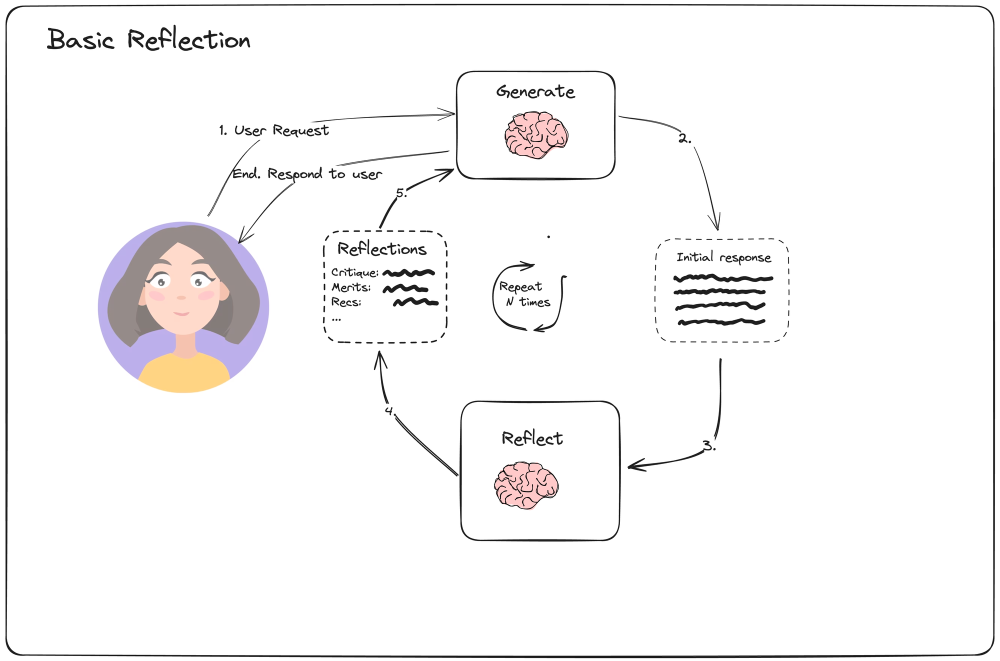
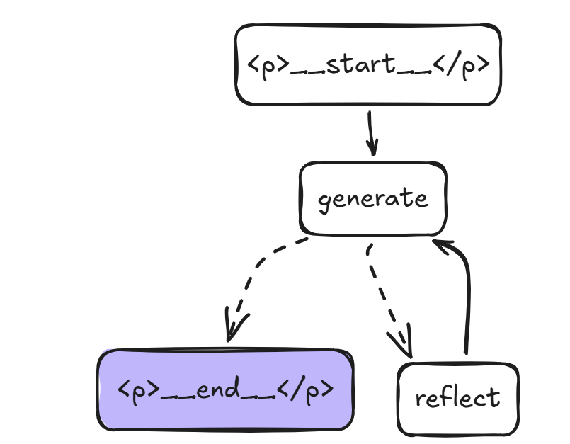

# Basic Reflection Agent with LangGraph

This branch, `reflection-agent`, demonstrates a small LangGraph reflection
agent. The app generates a LinkedIn post, asks a second chain to critique it,
feeds that critique back into the generator, and repeats until the graph reaches
its stopping condition.

## What This Branch Builds

- A two-node LangGraph workflow with `generate` and `reflect` nodes.
- A generation chain that writes or revises LinkedIn tech influencer posts.
- A reflection chain that critiques the generated post and recommends
  improvements around length, virality, style, and clarity.
- A feedback loop where reflection output is converted into a `HumanMessage`, so
  the generator treats critique as user feedback for the next revision.
- Graph visualization output using Mermaid, ASCII rendering, and checked-in PNG
  diagrams.

## Workflow Images

Conceptual reflection loop:



Compiled LangGraph workflow:



## How The Graph Works

```text
START
  |
  v
generate
  |
  v
should_continue
  |---- if len(messages) > 6 ----> END
  |
  |---- otherwise ----------------> reflect
                                      |
                                      v
                                   generate
```

The graph starts at `generate`. After every generation step,
`should_continue` checks the message history. When the message count is greater
than `MAX_MESSAGES`, the graph ends and returns the latest generated response.
Otherwise, the graph calls `reflect`, appends critique to the message history,
and sends the updated context back to `generate`.

## Project Structure

```text
.
|-- chains.py             # LangChain prompt templates and ChatOpenAI chains
|-- main.py               # LangGraph state, nodes, edges, and sample invocation
|-- basicreflection.png   # Conceptual reflection-agent workflow image
|-- graph.png             # Rendered graph workflow image
|-- pyproject.toml        # Project metadata and dependencies
|-- uv.lock               # Locked dependency versions
`-- README.md             # Project documentation
```

## Key Files

`chains.py` defines the two model chains:

- `generator_chain`: creates the strongest possible LinkedIn post for the user
  request, or revises an earlier attempt when critique is present.
- `reflector_chain`: grades the generated content and gives detailed improvement
  recommendations.

`main.py` defines the LangGraph workflow:

- `MessagesState`: built-in LangGraph state schema that stores the running
  conversation under `state["messages"]`.
- `generation_node`: invokes `generator_chain` and appends the generated draft.
- `reflection_node`: invokes `reflector_chain` and wraps the critique as a
  `HumanMessage`.
- `should_continue`: ends the loop after the message history grows beyond
  `MAX_MESSAGES`.

## Requirements

- Python 3.13 or newer
- `uv`
- An OpenAI API key

Key dependencies are managed in `pyproject.toml`, including:

- `langgraph`
- `langchain`
- `langchain-core`
- `langchain-openai`
- `python-dotenv`
- `grandalf`

## Setup

Install dependencies:

```bash
uv sync
```

Create a `.env` file in the project root:

```bash
OPENAI_API_KEY=your_openai_api_key
```

The app loads environment variables with `python-dotenv`, and `ChatOpenAI` uses
the OpenAI key from the environment.

## Run

```bash
uv run python main.py
```

When the script runs, it prints:

- The Mermaid representation of the graph.
- The ASCII representation of the graph.
- The final revised LinkedIn post from the reflection loop.

## Trying A Different Prompt

The current sample input is hard-coded in `main.py`. To test a different post or
request, update the content passed to `HumanMessage`:

```python
inputs = HumanMessage(content="Make this LinkedIn post better: ...")
response = graph.invoke({"messages": [inputs]})
```

Then run the script again:

```bash
uv run python main.py
```

## Current Model Setup

`chains.py` uses separate models for generation and critique:

- `gpt-5.4-nano` for lower-cost draft generation.
- `gpt-5.4-mini` with `reasoning_effort="high"` for stronger critique.

Adjust these model names in `chains.py` if your OpenAI account uses different
model access.

## Current Limitations

- The app is a script-based demo, not a CLI or web service.
- The sample input is hard-coded in `main.py`.
- The loop limit is based on message count, not quality score or explicit model
  confidence.
- The checked-in `graph.png` should be regenerated if the graph nodes or edges
  change.
