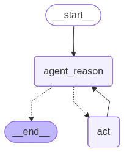

# ReAct-Agent-Function-Calling

This branch contains a small ReAct-style agent built with LangGraph, LangChain, OpenAI tool calling, and Tavily search. The branch implements an agent that can reason over a user request, decide whether tool use is required, execute tools, and loop back through the graph until it has enough information to return a final answer.

The sample prompt in `main.py` asks for the live temperature in Guntur and then asks the agent to triple it. That exercise demonstrates both parts of the implementation: retrieving current information with Tavily and applying a custom Python tool through LangGraph's tool execution node.

## What Was Built

- A LangGraph `StateGraph` using `MessagesState` as the shared state container.
- A reasoning node that calls an OpenAI chat model with tools bound to it.
- A tool execution node powered by LangGraph's prebuilt `ToolNode`.
- Conditional routing that either ends the graph or sends execution to the tool node based on whether the latest model response contains tool calls.
- A custom `triple` tool that multiplies a numeric value by three.
- Tavily search integration for live web-backed information.
- Automatic graph diagram generation to `flow.png`.

## Graph Flow

The graph follows a simple reason-act loop:

1. The user message enters the `agent_reason` node.
2. The LLM reasons over the conversation and decides whether it needs a tool.
3. If there are no tool calls, the graph ends and returns the final response.
4. If tool calls are present, execution moves to the `act` node.
5. The `act` node runs the requested tool and appends the result to the message state.
6. Control returns to `agent_reason` so the LLM can continue reasoning with the tool result.



The diagram is generated from the compiled LangGraph application with:

```python
app.get_graph().draw_mermaid_png(output_file_path="flow.png")
```

## How It Was Implemented

### `main.py`

`main.py` runs the sample invocation:

- Imports the compiled graph application from `graph.py`.
- Sends the sample temperature-and-triple prompt as a `HumanMessage`.
- Prints the final assistant response from the message state.

### `graph.py`

`graph.py` wires the graph together:

- Defines graph node names: `agent_reason` and `act`.
- Implements `should_continue`, which checks the latest AI message for tool calls.
- Adds the reasoning node and tool node to the graph.
- Sets `agent_reason` as the entry point.
- Adds a conditional edge from `agent_reason` to either `END` or `act`.
- Adds a loop edge from `act` back to `agent_reason`.
- Compiles the graph into `app`.
- Regenerates `flow.png` from the compiled graph.

### `nodes.py`

`nodes.py` contains the graph node behavior:

- Defines the system prompt that tells the assistant how to use tools.
- Implements `run_agent_reasoning`, which calls the tool-bound LLM with the system message and current message history.
- Creates `tool_node` using LangGraph's prebuilt `ToolNode`.

### `llm.py`

`llm.py` defines the model and tools:

- Loads environment variables with `python-dotenv`.
- Defines the custom `triple(num: float) -> float` tool.
- Creates a Tavily search tool with `max_results=1`.
- Binds both tools to `ChatOpenAI`.
- Uses `gpt-5-nano` with temperature set to `0` for deterministic behavior.

## Repository Structure

```text
.
├── README.md
├── flow.png
├── graph.py
├── llm.py
├── main.py
├── nodes.py
├── pyproject.toml
└── uv.lock
```

## Requirements

- Python `>=3.13`
- `uv` for dependency management
- OpenAI API key
- Tavily API key

Create a `.env` file in the repository root:

```env
OPENAI_API_KEY=your_openai_api_key
TAVILY_API_KEY=your_tavily_api_key
```

The `.env` file is ignored by Git through `.gitignore`.

## Setup

Install the dependencies from `pyproject.toml` and `uv.lock`:

```bash
uv sync
```

## Run

Execute the sample graph:

```bash
uv run python main.py
```

The script will:

1. Load environment variables.
2. Import `graph.py`, which compiles the LangGraph workflow.
3. Regenerate `flow.png` from the compiled workflow.
4. Invoke the agent with the sample temperature-and-triple request.
5. Print the final assistant response.

## Example Behavior

For the sample input:

```text
What is the temperature in Guntur? List it and then triple it
```

The agent should:

1. Use Tavily search to retrieve current temperature information.
2. Extract the relevant numeric temperature value.
3. Call the `triple` tool with that number.
4. Return the temperature and the tripled result in the final response.

## Dependencies Used

- `langgraph` for graph orchestration.
- `langchain` and `langchain-core` for message and tool abstractions.
- `langchain-openai` for the OpenAI chat model.
- `langchain-tavily` for live search.
- `python-dotenv` for local environment variable loading.
- `black` and `ruff` for formatting and linting support.

## Development Notes

- The graph state is message-based, so each LLM response and tool output is appended to `MessagesState`.
- The loop continues only while the latest model response includes tool calls.
- `ToolNode` handles tool dispatch, execution, and message conversion, which keeps the graph code small.
- `flow.png` is checked into the repository so the graph structure is visible directly from the README.

## LangSmith Trace

https://smith.langchain.com/public/77962233-ba2c-4185-9d86-2219f113cd23/r
