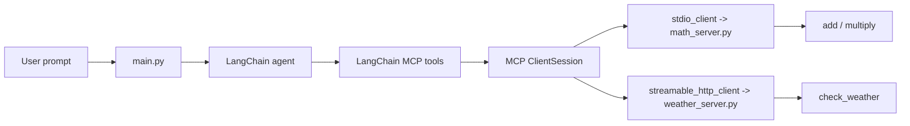

# MCP

This branch demonstrates how to expose Python functions as Model Context Protocol
tools and consume those tools from a LangChain agent. It includes two MCP server
transports:

- `stdio`: the client starts a local MCP server process for math tools.
- `streamable-http`: the weather server runs as a standalone HTTP service and
  the client connects to its `/mcp` endpoint.

The current entry point is [main.py](./main.py). It creates a `ChatOpenAI`
model, opens an MCP client session, loads the MCP tools into LangChain, creates
an agent, and invokes the agent with a natural-language question.

## Repository Layout

```text
.
|-- main.py                    # MCP clients and LangChain agent execution
|-- servers/
|   |-- math_server.py          # FastMCP stdio server with add/multiply tools
|   |-- weather_server.py       # FastMCP streamable HTTP server with weather tool
|   `-- __init__.py
|-- test.ipynb                 # Small scratch notebook for FastMCP experiments
|-- pyproject.toml             # Project metadata and dependencies
|-- uv.lock                    # Locked dependency graph
|-- .python-version            # Python version used by the project
`-- README.md
```

## What This Project Demonstrates

The project is intentionally small so developers can see the complete path from
server tool definition to agent tool use:

1. `servers/math_server.py` defines Python functions and registers them as MCP
   tools with `@mcp.tool()`.
2. `servers/weather_server.py` defines an async tool and serves it over
   Streamable HTTP.
3. `main.py` opens the appropriate MCP transport.
4. `ClientSession.initialize()` performs the MCP initialization handshake.
5. `load_mcp_tools(session)` converts MCP tools into LangChain-compatible tools.
6. `create_agent(llm, tools)` builds an agent that can call those tools.
7. `agent.ainvoke(...)` sends a user prompt and lets the model decide which tool
   to call.

## Prerequisites

- Python `3.13` or newer. The repo includes `.python-version` with `3.13`.
- `uv` is recommended because this repo includes `uv.lock`.
- An OpenAI API key for `ChatOpenAI`.

Create a local `.env` file in the project root:

```env
OPENAI_API_KEY=your_openai_api_key_here
```

`.env` is ignored by git, so do not commit secrets.

## Setup

Clone the repository and check out this branch:

```bash
git checkout mcp
```

Install dependencies with `uv`:

```bash
uv sync
```

If you are not using `uv`, create a virtual environment and install the packages
listed in `pyproject.toml`:

```bash
python -m venv .venv
python -m pip install --upgrade pip
python -m pip install "black>=26.3.1" "ipykernel>=7.2.0" "langchain>=1.2.17" "langchain-mcp-adapters>=0.2.2" "langchain-openai>=1.2.1" "langgraph>=1.1.10" "python-dotenv>=1.2.2" "ruff>=0.15.12"
```

The `uv` path is preferred because it uses the checked-in lockfile.

## Architecture



There are three important layers:

- MCP servers expose tools. `FastMCP` turns decorated Python functions into MCP
  tool definitions.
- MCP clients provide transport. `stdio_client` talks to a subprocess over
  stdin/stdout, while `streamable_http_client` talks to an HTTP endpoint.
- LangChain adapts tools. `load_mcp_tools` converts the MCP tools into the tool
  format expected by `create_agent`.

## Server Transports

| File | Transport | Lifecycle | Tools |
| --- | --- | --- | --- |
| `servers/math_server.py` | `stdio` | Started by the client process | `add`, `multiply` |
| `servers/weather_server.py` | `streamable-http` | Started separately as an HTTP server | `check_weather` |

### Stdio Server

The math server ends with:

```python
mcp.run("stdio")
```

That means the client must spawn the server process. In `main.py`, this is done
with `StdioServerParameters`:

```python
stdio_server_params = StdioServerParameters(
    command="python",
    args=[
        "<fill with your file path>\\AgenticAI-OnRamp-with-Langgraph\\servers\\math_server.py"
    ],
)
```

Replace the placeholder path with the absolute path to `servers/math_server.py`.
On Windows, use a raw string or escaped backslashes. Example:

```python
args=[
    r"C:\Users\you\path\AgenticAI-OnRamp-with-Langgraph\servers\math_server.py"
]
```

### Streamable HTTP Server

The weather server ends with:

```python
mcp.run("streamable-http")
```

With the current `FastMCP` defaults, the server listens on:

```text
http://127.0.0.1:8000/mcp
```

That is why `main.py` contains:

```python
weather_url = "http://127.0.0.1:8000/mcp"
```

For Streamable HTTP, the server is not started by `main.py`. Start it in a
separate terminal first.

## Running The Project

### Option 1: Run The Math Agent Over Stdio

1. Update `stdio_server_params.args` in `main.py` with the absolute path to
   `servers/math_server.py`.

2. At the bottom of `main.py`, enable `stdioclient()`:

```python
if __name__ == "__main__":
    asyncio.run(stdioclient())
    # asyncio.run(streamablehttpclient())
```

3. Run the client:

```bash
uv run python main.py
```

Expected behavior:

- `main.py` starts `servers/math_server.py` as a subprocess.
- The MCP session initializes.
- The available math tools are printed.
- The agent answers the prompt:

```text
what is the value of 8*5+5*3?
```

The expected numeric result is `55`.

### Option 2: Run The Weather Agent Over Streamable HTTP

1. Start the weather MCP server in terminal 1:

```bash
uv run python servers/weather_server.py
```

The server should start on `127.0.0.1:8000`.

2. In terminal 2, make sure `main.py` is configured to call
   `streamablehttpclient()`:

```python
if __name__ == "__main__":
    # asyncio.run(stdioclient())
    asyncio.run(streamablehttpclient())
```

3. Run the client:

```bash
uv run python main.py
```

Expected behavior:

- The client connects to `http://127.0.0.1:8000/mcp`.
- The MCP session initializes over HTTP.
- The weather tool is loaded into the LangChain agent.
- The agent answers the prompt:

```text
what is the weather in Guntur?
```

The current weather implementation is a mock response:

```text
The current weather for the Guntur is SuperHot
```

## Code Walkthrough

### `main.py`

`main.py` owns the client-side workflow:

- Loads environment variables with `load_dotenv()`.
- Creates the OpenAI chat model:

```python
llm = ChatOpenAI(model="gpt-5-nano", temperature=0)
```

- Defines stdio server launch parameters with `StdioServerParameters`.
- Defines the Streamable HTTP endpoint with `weather_url`.
- Provides two async client runners:
  - `stdioclient()`
  - `streamablehttpclient()`

Both client runners follow the same pattern:

```python
open MCP transport
create ClientSession
initialize session
load MCP tools into LangChain
create agent
invoke agent
print final answer
```

The main difference is the transport:

```python
stdio_client(stdio_server_params)
```

versus:

```python
streamable_http_client(weather_url)
```

`streamable_http_client` returns three values:

```python
read, write, get_session_id
```

`get_session_id` is useful when debugging session lifecycle, but this project
does not currently print it.

### `servers/math_server.py`

This server exposes two synchronous tools:

```python
@mcp.tool()
def add(a: int, b: int) -> int:
    return a + b

@mcp.tool()
def multiply(a: int, b: int) -> int:
    return a * b
```

Because it uses `mcp.run("stdio")`, it is designed for local subprocess
execution.

### `servers/weather_server.py`

This server exposes one async tool:

```python
@mcp.tool()
async def check_weather(location: str) -> str:
    return f"The current weather for the {location} is SuperHot"
```

Because it uses `mcp.run("streamable-http")`, it is designed to run as a
standalone HTTP server.

## Adding New Tools

To add a new MCP tool:

1. Choose the server file that should own the tool.
2. Add a Python function.
3. Decorate it with `@mcp.tool()`.
4. Add clear type hints and a short docstring. MCP clients use this metadata
   when exposing tools to the model.
5. Restart the relevant server or rerun the client.

Example:

```python
@mcp.tool()
def subtract(a: int, b: int) -> int:
    """Subtract b from a."""
    return a - b
```

For stdio servers, rerun `main.py` because the client starts the server. For
Streamable HTTP servers, restart the HTTP server process.

## Changing The HTTP Host, Port, Or Path

`FastMCP` defaults are:

```text
host = 127.0.0.1
port = 8000
streamable_http_path = /mcp
```

To change them, configure `FastMCP` in `servers/weather_server.py`:

```python
mcp = FastMCP(host="127.0.0.1", port=8001, streamable_http_path="/mcp")
```

Then update `weather_url` in `main.py`:

```python
weather_url = "http://127.0.0.1:8001/mcp"
```

## Development Commands

Format code:

```bash
uv run black .
```

Run Ruff checks:

```bash
uv run ruff check .
```

There is no automated test suite in this branch yet. `test.ipynb` is only a
scratch notebook for quick FastMCP experiments.

## Troubleshooting

### `OPENAI_API_KEY` errors

Make sure `.env` exists in the project root and contains:

```env
OPENAI_API_KEY=your_openai_api_key_here
```

### `FileNotFoundError` when running the stdio client

`stdio_server_params.args` still contains the placeholder path. Replace it with
the absolute path to `servers/math_server.py`.

### Weather client cannot connect

Start the weather server first:

```bash
uv run python servers/weather_server.py
```

Then run `main.py` in a second terminal. Also confirm `weather_url` matches the
server host, port, and path.

### Port `8000` is already in use

Change the `FastMCP` port in `servers/weather_server.py` and update
`weather_url` in `main.py` to match.

### The model does not call the expected tool

Print the loaded tools in `main.py` and confirm the tool is exposed. Also make
the prompt explicit enough for the model to choose the intended tool.

### Running from a notebook

Do not call `asyncio.run(...)` inside an already running notebook event loop.
Call the async function directly with `await`, for example:

```python
await streamablehttpclient()
```

## Current Limitations

- The weather tool is a mock implementation. It does not call a real weather API.
- `main.py` runs either the stdio client or the Streamable HTTP client depending
  on which line is enabled in the `__main__` block.
- The stdio server path is intentionally a placeholder and must be filled in for
  each developer's machine.
- The code imports `mcp` directly through packages resolved in `uv.lock`. If
  this branch becomes production code, consider adding `mcp` as an explicit
  direct dependency in `pyproject.toml`.

## Quick Reference

Run math over stdio:

```bash
uv run python main.py
```

Run weather over Streamable HTTP:

```bash
uv run python servers/weather_server.py
```

Then, in another terminal:

```bash
uv run python main.py
```
